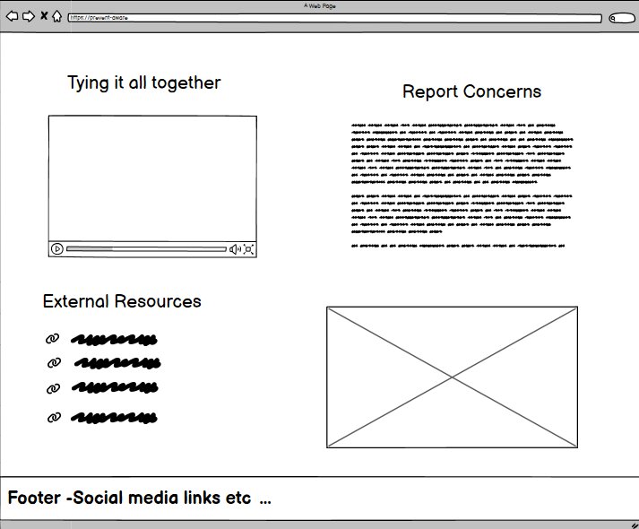

# Prevent Aware
Prevent Aware is a flagstone project with Code Institute, that aims to show a solid understanding of HTML and CSS. It's a single page website focusing on the PREVENT initiative created by the UK Government.

Users should expect to be able get a quick understanding of the main principles of PREVENT through a variety of media including: text, images and video.

Design choices for this project were focused on creating a sense of calm, while also maintaining a professional and cohesive look. A responsive design was also implemented to provide ease of navigation regardless of the device accessing the site.

## Desktop

## Tablet

## Mobile

## UX Design

### Typography

[**Font Awesome**](https://fontawesome.com) icons were used throughout the project. Examples being the contact and social media icons

[**Manrope**](https://fonts.google.com/specimen/Manrope) was used for headings.

[**Sora**](https://fonts.google.com/specimen/Sora?query=sora) was used for the main bodies of text.

### Colour Palette

A [**Colour Picker**](https://imagecolorpicker.com/) was used to grab various tones from one of the site's images.

This produced a colour palette like this:

 

Which was then refined into this:

Selecting a colour palette this way allowed for a cohesive design between both the site's text and images. A Dark Teal was used as the primary colour, namely the navigation bar, headers and buttons, a lighter teal was used on the button to give user feedback. A white was used for text on the navigation bar and footer to provide better contrast, as well as for the background. A light grey was used on the social icons to again provide user feedback. All other text is black for contrast.

### Wireframes

#### Desktop

#### Mobile

 

#### Tablet

 

# User Stories

<strong>As a user , I want the website to be able to access the site regardless of whether I am on desktop or mobile so I can view the page content on any device.</strong>

- The website is fully responsive across various devices and screen sizes.

- Site layout and navigation are intuitive, allowing easy access to different sections.

<strong>As a user with accessibility needs, I want the website to have proper colour contrast and alt text for images, so that I can access all the information regardless of my abilities.</strong>

- All images used should have alt text

- Colour pallete used should contrast and be easy to read

<strong>As a first-time user, I want the information to be organised in clear sections with headers, so that I can easily find the specific information I need.
</strong>

- Information is organised clearly in sections with headers

- Internal links should help users navigate to specific sections of information

<strong>As a user seeking help, I want prominent call-to-action buttons, so that I can quickly access resources or reporting mechanisms without searching.</strong>

- Clear and contrasting call-to-action buttons

- Call-to-action buttons are available to the user without the need for searching

- Links to external resources available for the user

<strong>As a first time user, I want to quickly understand what the Prevent strategy is, so that I can learn about its purpose and importance in the community.</strong>

- A clear, concise introduction to Prevent is visible within the first viewport on desktop and mobile

- The explanation uses plain language accessible to a general audience

- The purpose and importance are highlighted prominently

<strong>As a concerned individual, I want to easily recognise the signs of radicalisation, so that I can identify potential risks in my community or workplace.</strong>

- Signs of radicalisation are presented in a clear, scannable format (e.g., bullet points or list groups)

- Information is organised logically with clear headings

- Content avoids jargon and uses accessible language

- Visual hierarchy makes key points stand out

<strong>As a member of the public, I want clear information on how to report concerns, so that I can take appropriate action if I suspect someone is at risk.</strong>

- Contact details or links to reporting mechanisms are clearly visible

- Reporting information is easily findable and prominently displayed

# Features

# Testing

# Deployment

# AI

# Credits
